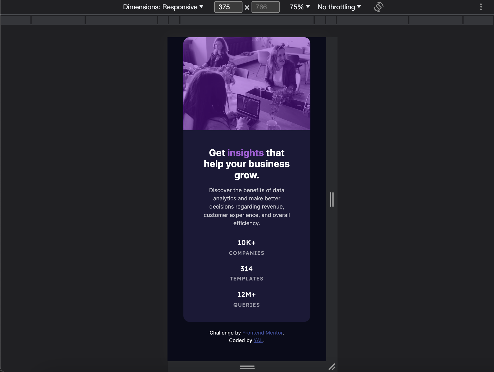

# Frontend Mentor - Stats preview card component solution

This is a solution to the [Stats preview card component challenge on Frontend Mentor](https://www.frontendmentor.io/challenges/stats-preview-card-component-8JqbgoU62). Frontend Mentor challenges help you improve your coding skills by building realistic projects. 

## Table of contents

- [Overview](#overview)
  - [The challenge](#the-challenge)
  - [Screenshot](#screenshot)
  - [Links](#links)
- [My process](#my-process)
  - [Built with](#built-with)
  - [What I learned](#what-i-learned)
  - [Continued development](#continued-development)
- [Author](#author)
- [Acknowledgments](#acknowledgments)

## Overview
### The challenge
Users should be able to:
- View the optimal layout depending on their device's screen size

### Screenshot



### Links
- Live Site URL: 

## My process
### Built with
- Semantic HTML5 markup
- CSS custom properties
- Bootstrap
- Flexbox
- CSS Grid

### What I learned
使用flex-direction，讓排序反轉。

```css
.row {
  flex-direction: column-reverse;
}
```

### Continued development
bootstrap & breakpoint

## Author
- Frontend Mentor - [@YAcodingroom]
(https://www.frontendmentor.io/profile/YAcodingroom)
- Threads - [@nt19_lya](https://www.threads.net/@nt19_lya)

## Acknowledgments
感謝Ivy&Ciao，感謝Angela老師，感謝靜文老師，感謝Google，感謝Bootstrap，感謝宇宙，感謝自己的不放棄。